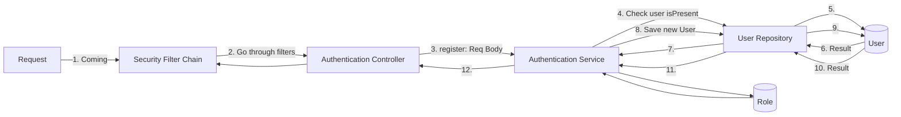
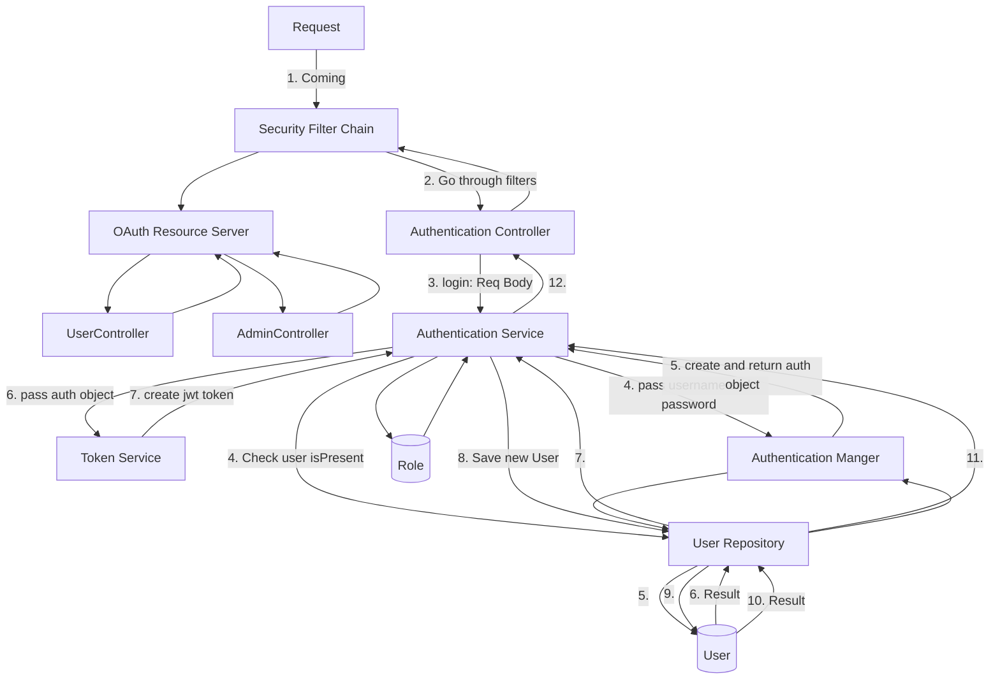

# Diagram
## Register Flow

```mermaid
flowchart LR
    Req[Request]
    SFC[Security Filter Chain]
    AuthC[Authentication Controller]
    AuthS[Authentication Service]
    UR[User Repository]
    U[(User)]
    R[(Role)]
    
    Req -->|1. Coming| SFC
    SFC -->|2. Go through filters| AuthC
    AuthC -->|3. register: Req Body| AuthS
    AuthS -->|4. Check user isPresent| UR
    UR -->|5. | U
    U -->|6. Result |UR
    UR -->|7. | AuthS
    AuthS -->|8. Save new User | UR
    UR -->|9. | U
    U -->|10. Result | UR
    UR -->|11. | AuthS
    AuthS -->|12. | AuthC
    
    AuthS --> R
    R --> AuthS
    
    AuthC --> SFC
```

## Login Flow

```mermaid
flowchart TB
    Req[Request]
    SFC[Security Filter Chain]
    ORS[OAuth Resource Server]
    UC[UserController]
    AC[AdminController]
    AuthC[Authentication Controller]
    AuthS[Authentication Service]
    TS[Token Service]
    UR[User Repository]
    AM[Authentication Manger]
    U[(User)]
    R[(Role)]
    
    Req -->|1. Coming| SFC
    SFC -->|2. Go through filters| AuthC
    AuthC -->|3. login: Req Body| AuthS
    AuthS -->|4. pass username and password| AM
    AM -->|5. create and return auth object| AuthS
    AuthS -->|6. pass auth object| TS
    TS -->|7. create jwt token| AuthS
    AuthS -->|4. Check user isPresent| UR
    UR -->|5. | U
    U -->|6. Result |UR
    UR -->|7. | AuthS
    AuthS -->|8. Save new User | UR
    UR -->|9. | U
    U -->|10. Result | UR
    UR -->|11. | AuthS
    AuthS -->|12. | AuthC
    
    AuthS --> R
    R --> AuthS
    
    SFC --> ORS
    AuthC --> SFC
    

    
    


    UR --> AM
    AM --> UR

 
    ORS --> UC
    UC --> ORS
    ORS --> AC
    AC --> ORS
```

# Ref
- [Spring Security 6 - Login System with Spring Data JPA and JWTs](https://youtu.be/TeBt0Ike_Tk?si=GDhH_V0KQxvkEBMV)