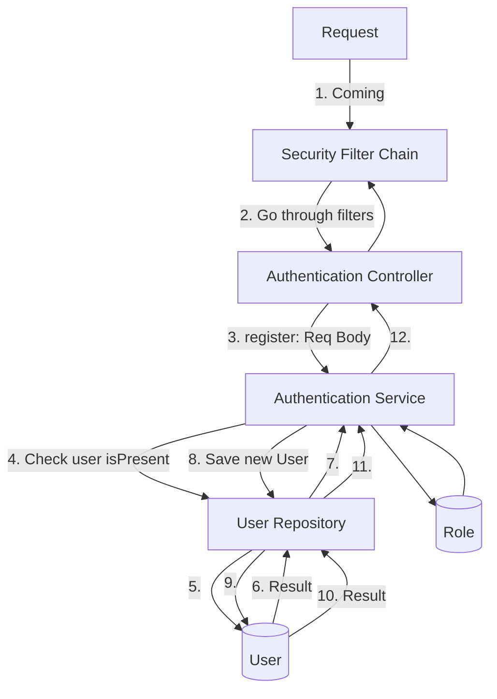
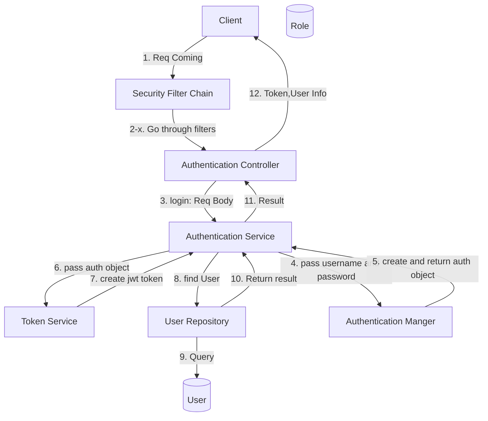
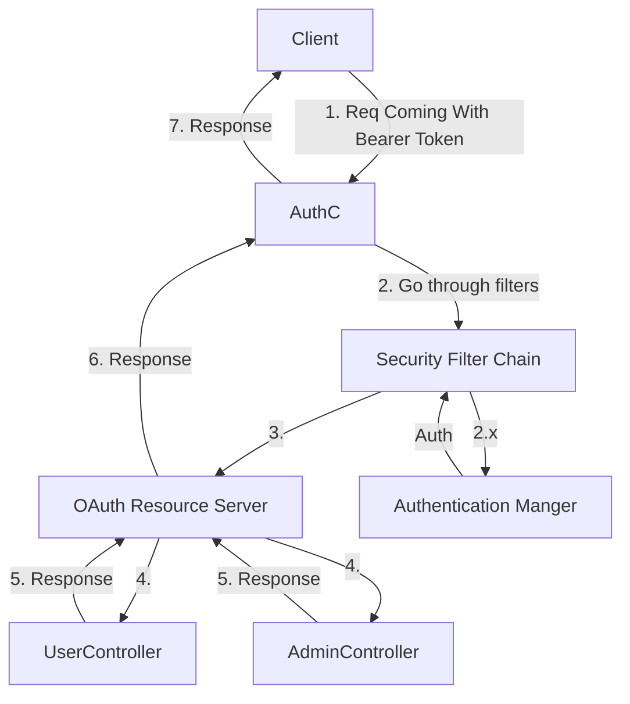

# Diagram
## Register Flow

## Login Flow

## After Login, Use Token Access Resource Flow

# Ref
- [Spring Security 6 - Login System with Spring Data JPA and JWTs](https://youtu.be/TeBt0Ike_Tk?si=GDhH_V0KQxvkEBMV)